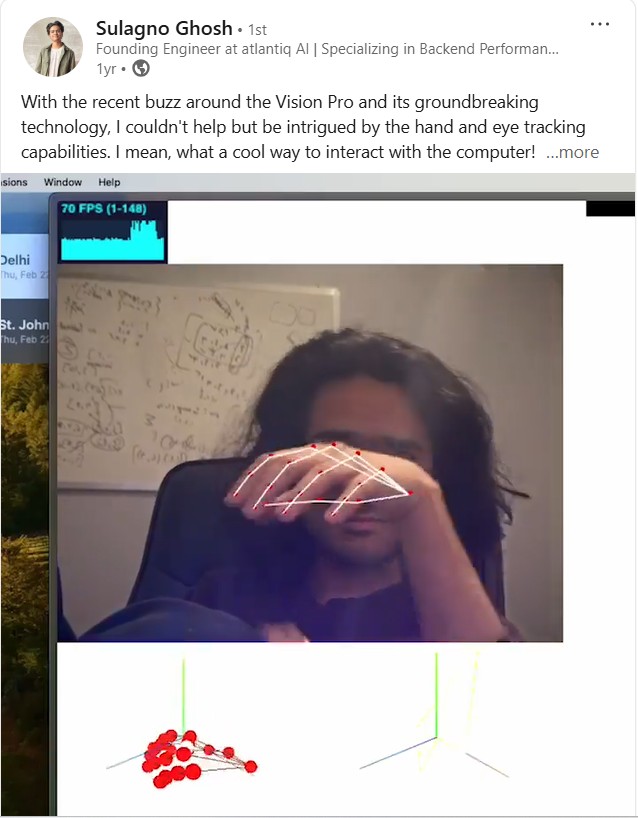
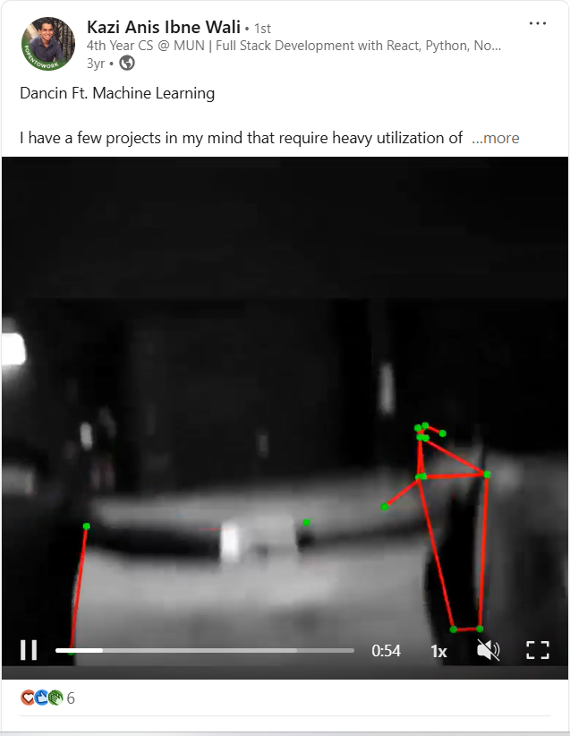

# Story of this project

Hi, I am Arnob. I wrote my first "Hello World" in Python in 2021 Fall, the semester I came to MUN, and took Comp 1000 and 1001 alongside a Psych and an English course.

## Before programming
Programming was never taught in the school I studied. In school-days, till around ninth grade, I was fond of mathematics: I was not good at it, let's just say, "when forced to study, I just preferred mathematics." At one point, mathematics started to have topics like simple interest, compound interest (I still don't know what they mean) etc. but there was a subject called "physics" that became more mathematical: trigonometry, calculus, cartesian coordinates, polar coordinates, vectors etc. Physics started to feel like an applied version of mathematics. With physics, maths seemed to make more sense, almost all maths concepts are found in physics and it made me believe that maybe it has always been physics that interests me. However, there was this one topic from maths that sounded very cool to me, maybe because there was a cool movie named after it? - I don't know, the name itself just sounds so cool: matrix. I could not find its application in physics, I used to ask my teachers and elders where this matrix gets applied: a problem where I would want to or need to use matrices for a solution: there were two types of replies:

1. You will learn in the future.
2. Many computer programs use matrices.

Around that time I stumbled upon this quote:


I understood that understanding the application of matrices was going to be a long journey that starts with learning to program. Well, if you look-up on the internet, learning to program itself has a long roadmap:


This was the time when my secondary education was coming to an end. I had to decide what to study in the university. With a closer goal of learning to program and a further goal of learning about matrices, I decided to study Computer Science at MUN.

## Hello programming!
At MUN, Comp-1000, Comp-1001 are some of the introductory courses in Computer Science. Then there are some courses you have to take if you want a degree in CS, one of them being Data Structures and Algorithms that professor Tricco was teaching when I took it. One of the data structures I learned there was graphs. A graph can be implemented in a lot of ways, one of the ways being: adjacency matrix. I had not expected to reached the goal of finding matrices just in my second year and I realised that the goal was not really reached: adjacency matrix, as taught in the course, was only a square-shaped 2D array of objects. I am not saying that adjacency matrix is not a matrix, it was nice to see how matrix is a way of organising data, but there was no matrix operation like addition, subtraction, multiplication, inversion, transposition etc. The course was also a struggle: 

1. In that semester I realised how a CS degree works. CS is not a degree of teaching you some programming language: CS will invest maximum one course to teach you a programming language. In MUN, that course is Comp-1001, once that course ends, you are assumed to be a Python programmer. When they say that Comp 2002 (the Data Structure and Algorithm course) is based on Python, I had expected to learn advanced Python syntax in the course but reality was, as we were Python programmers (no one bothering to know if we were proficient enough in the language), the Python part was our responsibility whereas the Data Structures and Algorithms part was what got taught in the lectures. Now you tell me, if writing a program simply means typing with your keyboard and someone sketches this graph for you to write in Python:

How?
```python
print("vertex 1 connects with vertex 1")
print("vertex 1 and vertex 2 connected")
print("vertex 2 and vertex 3 connected")
print("I m cooked")
```
2. I only lately reached out to the instructor for help. Some instructors (don't expect everyone) care and do not want to see a student struggling in their course. Fortunately professor Tricco was one of them. Till date, he is the professor I sent highest number of emails to, and he replied politely to each of them, a lot of times privately tutored me in understanding object-oriented Python in his office for free when it was not his duty to teach me Python. This only makes me regret now: if I had contacted him earlier, the course could go better. I got an A in the course so I never retook it but here is the take-away from my regret: do not be late in reaching out to the instructor when you are struggling; a lot (90%) of times you will not get the help you need but at least then it will be one of those problems where there is nothing you can do anyway.


After second year, CS allows you to choose your courses; I prioritised taking courses based on who was teaching them - teachers I can learn from by the end of a semester. In this way in 2024 I took another course called Data Visualisation, with professor Tricco. My most favourite course in MUN for several reasons, one of the reasons being the amount of creativity in the course assignments. In one of the assignments, we were asked to create a version of this data visualisation by CNN, using Matplotlib given the data.


We all did the assignment but I was curious, where did professor get the data that represents this exact chart, when the data is not on the internet. Did he ask CNN for the data? Did he print the chart and measure the radius of each circle with a centimeter-rule (if you know the ratio of the size of each circle you do not need the exact data)? I asked professor and learned something that affects my present: OpenCV. 
<div style="background-color: black; width:20%">

</div>
If you know a little bit of Python, you can give your computer an image and ask it how many circles there are, where each circle is and what is the radius of each circle. "OpenCV" stands for "open computer vision." The idea of a computer being able to "see" an image fascinated me. I am not sure if I am trapped by a certain LinkedIn algorithm, yet I am going to say this: If you have a LinkedIn account and have connections to a few software developers, you are bound to see some post about some project involving hand detection or human pose detection.




That's OpenCV. OpenCV became my motivation to enhance my programming skill, that one day I will also have an OpenCV project. Matrix? Well, Data Visualisation, which was a fourth-year-level course was getting completed with no sign of a matrix. Maybe I did not learn enough programming to get introduced to matrices? I lost hope in finding matrices and started focusing more on programming for the rest of the degree. 

In Winter 2025 professor Prado launched a new course based on the book Modern Robotics. I had taken two second-year courses with him: one on Computer Architecture and another on OS. Here is something about the professor, explicitly stated in his website: one of his research interest is robotics. A whole course based on his research interest! And if you remember I mentioned earlier: "I prioritised taking courses based on who was teaching them - teachers I can learn from by the end of a semester." Just like that I took the course. Initially, the course was not making sense. Firstly, the book is cryptic, everything is written so formally like some research paper, the YouTube videos and Coursera courses based on the book are such that they do not repeat or expand to something they state - they state a concept and just like that move on to the next concept. 


By the end of chapter 2 I was thinking of dropping the course when it was talking about degree of freedom, configuration space etc. with no sign of programming. With the last straw of patience, as I reached chapter-3, I saw matrices. This one chapter did not only demonstrate the application of matrices but made me appreciate the existence of matrices because this is where I saw in what type of scenarios to solve a problem you would want to introduce matrices or want to do operations like matrix multiplication, inversion, transposition etc. Programming? Well, it was there too: only from chapter-3, the book starts implementing several concepts with Python and Matlab. You see, there's a reason to include this part in this story. If you have taken any university course, not necessarily CS, or any online or in-person course, what is the normal progression? Typically, a course starts easy. Even the Comp 2002 I mentioned earlier started easy, with obvious or previously learned concepts. Gradually, two things happen: from your end, the enthusiasm decreases; from the course's end topics get more advanced. Unfortunately, you are kept responsible for fighting both these enemies. In my university experience, a normal course has always been about how many slides or pages from the last few lectures can I afford to risk since I had to fight those two enemies during the semester. And I feel it normal because I think if a course or a book is such that you could understand every detail from the very beginning to the very end, the course or the book was probably not worth it or too primitive for you; you should try something more advanced - out of comfort. But then there are courses like this robotics one that make you feel lost from the very beginning - the language seems Greek to you. This may not be a normal progression for a course, you may feel that there is some book or some course you probably missed reading before this book or course for which you are getting this massive push from the very beginning, but from my experience I can tell you, this happens when you are about to learn something novel - something you have never been even near to before. And you will learn: the more valuable and novel concept there is in the horizon for you, the bigger push you are going to get. So, try to stick to it.

In April 2025 this project repo was born. It is a Python project, as its name suggests it is hugely dependent on OpenCV, yes, and implementing concepts from chapter-3 of Modern Robotics (matrices!). The project is open to contribution. For now, you just heard my story behind the features I contributed here but after you add a feature, send me your story to arnobg2002@gmail.com in any format (pdf or md or slides) and I myself will push the stories of all the contributors to this repo. 